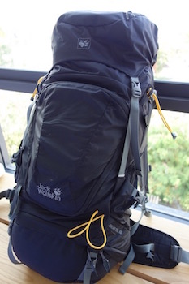
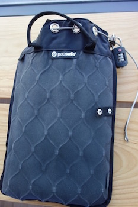

Die größte Frage die sich einem vor Abreise stellt ist meist "Was packe ich ein?".
Grundsätzlich solltet man sich bei jedem Teil fragen wie oft man es braucht, ob es notwendig ist und wenn ja ob es möglicherweise leichtere oder kleiner alternativen gibt.
Es empfiehlt sich auch während der Reise (nach ca. 4 Wochen) erneut die gleichen Fragen zu stellen.
Es gibt Nomaden die nur mit Handgepäck reisen, ich allerdings habe mich dafür entschieden einen Backpack zu nutzen und über den Zeitraum meiner Reise Stück für Stück minimaler zu leben.
Im moment reise ich mit ca. 13 Kg. Ich möchte aber auf 10kg minimieren.  

### Rucksack

Wenn man sich für einen Rucksack entscheidet sollte man darauf achten, das dieser sich von oben wie ein Koffer öffnen lässt.
Somit muss man nicht immer den kompletten Rucksack auspacken, wenn man etwas von ganz unten braucht.
Ich habe mich für den <a rel="nofollow" href="http://www.amazon.de/gp/product/B00H8BLNKK/ref=as_li_tl?ie=UTF8&camp=1638&creative=19454&linkCode=as2">Jack Wolfskin HIGHLAND TRAIL XT 50 Rucksack</a> entschieden und bin begeistert.
Er hat ein großes sowie ein kleineres Fach. Das große lässt sich von oben sowie von der Seite des Rucksacks bepacken.
Das etwas kleinere Fach befindet sich unten. Zusätzlich bieten einige kleine Fächer Stauraum für für Ladegeräte und Kabel.

 

Wer minimaler reisen möchte dem empfehle ich den <a rel="nofollow" href="http://www.amazon.de/gp/product/B00M0P1TUI/ref=as_li_tl?ie=UTF8&camp=1638&creative=19454&linkCode=as2">Cabin Max Oxford Rucksack</a>.

### DayPack

Ein zweiter Rucksack oder/und ein Jutebeutel sollte man für Tagesausflüge oder Supermarkteinkäufe mitnehmen.
Ich habe einen Jutebeutel den man auch als Rucksack nutzen kann und eine schwarzen einfachen Rucksack von Topman der sich klein zusammenfalten lässt.

 

### Packsafe

Unerlässlig wenn man mit teuren Geräten reist! Der Packsafe ist ein portabler Safe in den ein 13'' Macbook sowie alle meine wichtigen Sachen wie <a rel="nofollow" href="http://www.amazon.de/gp/product/B00O32GGTK/ref=as_li_tl?ie=UTF8&camp=1638&creative=6742&creativeASIN=B00O32GGTK&linkCode=as2&tag=wanderlust07-21">GoPro</a>, Reisepass, Sony RX100 und Ipad passen.
Ich habe mich für die 5L variante entschieden.

 

Es gibt auch eine
<a rel="nofollow" href="http://www.amazon.de/gp/product/B00KU52GU2/ref=as_li_tl?ie=UTF8&camp=1638&creative=19454&linkCode=as2">Pacsafe Rucksack</a>.

### Technisches Equitment

* <a rel="nofollow" href="http://www.amazon.de/gp/product/B00MVZ89O6/ref=as_li_tl?ie=UTF8&camp=1638&creative=6742&creativeASIN=B00MVZ89O6&linkCode=as2&tag=wanderlust07-21">  Macbook 13'' Retina </a>
* <a rel="nofollow" href="http://www.amazon.de/gp/product/B00G9T8ZWG/ref=as_li_tl?ie=UTF8&camp=1638&creative=6742&creativeASIN=B00G9T8ZWG&linkCode=as2&tag=wanderlust07-21"> Ipad Mini</a>
* <a rel="nofollow" href="http://www.amazon.de/gp/product/B00F8JDD2K/ref=as_li_tl?ie=UTF8&camp=1638&creative=6742&creativeASIN=B00F8JDD2K&linkCode=as2&tag=wanderlust07-21">  Iphone 5s 32 GB </a>
* <a rel="nofollow" href="http://www.amazon.de/gp/product/B00O32GGTK/ref=as_li_tl?ie=UTF8&camp=1638&creative=6742&creativeASIN=B00O32GGTK&linkCode=as2&tag=wanderlust07-21">GoPro Hero 4 Black</a>
* <a rel="nofollow" href="http://www.amazon.de/gp/product/B00DM8R866/ref=as_li_tl?ie=UTF8&camp=1638&creative=6742&creativeASIN=B00DM8R866&linkCode=as2&tag=wanderlust07-21">Sony Rx 100</a>
* <a rel="nofollow" href="http://www.amazon.de/gp/product/B00009ZSYG/ref=as_li_tl?ie=UTF8&camp=1638&creative=6742&creativeASIN=B00009ZSYG&linkCode=as2&tag=wanderlust07-21">Sennheiser HD 25-1 II Kopfhörer</a>
* <a rel="nofollow" href="http://www.amazon.de/gp/product/B00QJDO0QC/ref=as_li_tl?ie=UTF8&camp=1638&creative=6742&creativeASIN=B00QJDO0QC&linkCode=as2&tag=wanderlust07-21">Kindle Paperwhite</a>
* HTC Desire 510
* <a rel="nofollow" href="http://www.amazon.de/gp/product/B014D1N0CG/ref=as_li_tl?ie=UTF8&camp=1638&creative=6742&creativeASIN=B014D1N0CG&linkCode=as2&tag=wanderlust07-21"> Bluetooth Stick mit Stativ</a>
* <a rel="nofollow" href="http://www.amazon.de/gp/product/B01422TC14/ref=as_li_tl?ie=UTF8&camp=1638&creative=6742&creativeASIN=B01422TC14&linkCode=as2&tag=wanderlust07-21">Power Bank</a>

### Sonstiges

* <a rel="nofollow" href="http://www.amazon.de/gp/product/B000UUOVEG/ref=as_li_tl?ie=UTF8&camp=1638&creative=19454&creativeASIN=B000UUOVEG&linkCode=as2&tag=wanderlust07-21">Vakuumbeutel für Kleidung</a>
* <a rel="nofollow" href="http://www.amazon.de/gp/product/B004FVA5YG/ref=as_li_tl?ie=UTF8&camp=1638&creative=19454&creativeASIN=B004FVA5YG&linkCode=as2&tag=wanderlust07-21">Frischhaltedose 1L</a>
* Mückenspray 50% DEET (<a rel="nofollow" href="http://www.amazon.de/gp/product/B00E65VHB6/ref=as_li_tl?ie=UTF8&camp=1638&creative=19454&creativeASIN=B00E65VHB6&linkCode=as2&tag=wanderlust07-21">Kleidung</a> & <a rel="nofollow" href="http://www.amazon.de/gp/product/B00E66ZOKU/ref=as_li_tl?ie=UTF8&camp=1638&creative=19454&creativeASIN=B00E66ZOKU&linkCode=as2&tag=wanderlust07-21">Haut</a>)
* <a rel="nofollow" href="http://www.amazon.de/gp/product/B00PW155ZM/ref=as_li_tl?ie=UTF8&camp=1638&creative=19454&creativeASIN=B00PW155ZM&linkCode=as2&tag=wanderlust07-21"> Kofferwaage</a>
* <a rel="nofollow" href="http://www.amazon.de/gp/product/B00J250F6I/ref=as_li_tl?ie=UTF8&camp=1638&creative=19454&creativeASIN=B00J250F6I&linkCode=as2&tag=wanderlust07-21">Campingbesteck</a>
* Notizbuch
* Koh Lanta Trash Hero Flasche (<a href="http://www.trashhero.org" target="_blank">www.trashhero.org</a>) *
* <a rel="nofollow" href="http://www.amazon.de/gp/product/B014HK1F5M/ref=as_li_tl?ie=UTF8&camp=1638&creative=19454&creativeASIN=B014HK1F5M&linkCode=as2&tag=wanderlust07-21">Jack Wolfskin Kulturbeutel Waschsalon</a>

* <small>Sachen die ich mir Unterwegs gekauft habe.</small>
