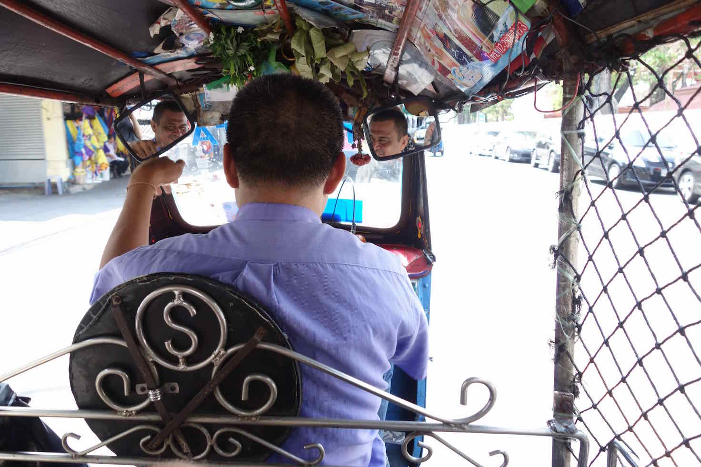
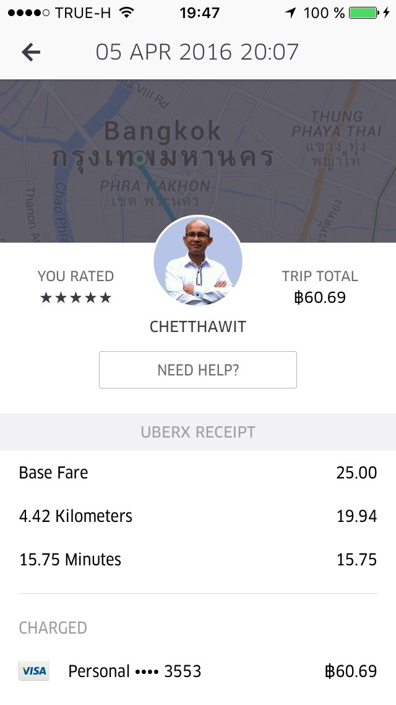
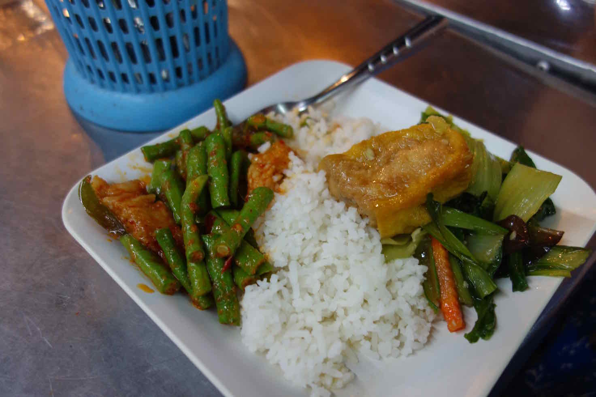
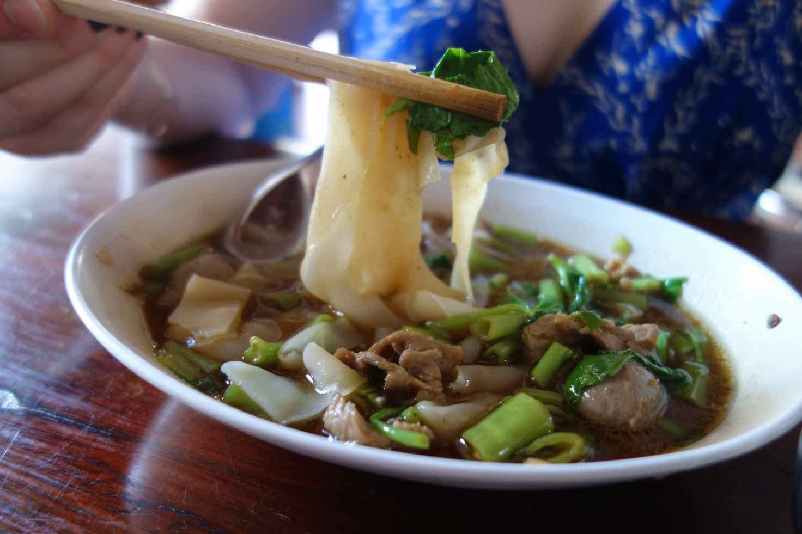

Bangkok ist für die meisten Reisenden die erste Stadt in Asien, da die Flüge aus Deutschland in diese Metropole am günstigsten sind.
Wenn asiatischen Großstädte nicht gewohnt ist, kann einem Bangkok schon ganz schön umhauen!
Alles ist ständig in Bewegung und es prasseln Tausende Eindrücke auf einen ein.

### How to get in?

Landet man am Suvarnabhumi Airport (BKK) kann man beruhigt ein Taxi in die Stadt nehmen.
Nach Chinatown kostet es ca. 350 THB.

Es gibt aber auch die Möglichkeit den Skytrain zu nutzen. Der Express Zug (15 min) kostet 100 THB und die Bimmelbahn (30 min) zwischen 15-40 THB.

### How to get around?

Tuk-Tuk, Motorradtaxi, Bus, Taxi, Boot, Skytrain, Metro oder Uber, das ist hier die Frage!

##### Tuk-Tuk

Sie sind Fluch und Segen zugleich!
Es macht unglaublich Spaß in einem durch Bangkok zu düsen, jedoch muss man sich immer wieder mit Schleppern oder überteuerten Preisen herumschlagen.
Achtet immer darauf, dass das Tuk-Tuk ein gelbes Kennzeichen hat! Es gibt Schlepper, die euch in vermeintliche Touristeninformationen fahren, wo ihr dann Tickets für irgendetwas kaufen sollt.

Grundsätzlich ist handeln Pflichtprogramm! Eine kurze Strecke für ca. 2 km sollte zwischen 40-50 Bath kosten.
Der Fahrer wird euch einen Preis von 100 THB vorschlagen. Wenn ihr euch auf 75 % des ursprünglichen Fahrpreises einigt, habt ihr eine angenehme Fahrt. Handelt ihr ihn auf 50 % wird die Fahrt etwas riskanter :)
Scheut euch auch nicht ein neues Tuk-Tuk anzuhalten, wenn der erste Fahrer nicht mit sich handeln lässt.

###### Tipp:

* Meiden sollte man Tuk-Tuks in der Rushhour (7:00-9:00 & 16:00-19:00).
* Ein Thai hat uns gesagt, dass man einfach <i>Phæng Phai (zu teuer)</i> sagt, wenn einem der Preis zu teuer. Danach sagt man einen neuen Preis.

 

##### Taxi

Taxis haben ein Taximeter-Schild auf dem Autodach sowie ein gelbes Kennzeichen und eine Lizenz links an der Windschutzscheibe. Einfach Hand raus und los gehts! Achtet darauf, dass das Taxi-Meter auch angemacht wird!
Der erste Kilometer kostet 35 Bath, danach jeder weitere 5 Baht.

Tipp: Es ist immer gut die Adresse in Thai auf einem Zettel zu haben.

##### Uber

Die wohl komfortabelste und einfachste Art in Bangkok von A nach B zu kommen.
Uber App auf Zielort eingegeben und ein Uber-Taxi request absenden.
Die Base Fare liegt bei 25 Bath und der km bei ca 5 Bath.
Das Gute ist, ihr braucht kein Bargeld und müsst dem Fahrer nicht stundenlang erklären, wo es hingehen soll...

 

##### Boot

Der Chao Phraya ist voll mit Expressbooten, deren Fahrt maximal 31 Baht pro Person kosten.
Die Boote haben verschieden Flaggen, die für die Linie stehen.
Am Einstiegsort befindet sich ein Schild mit welcher Linie welche Station anfährt.

##### Skytrain

Das Skytrain Tagesticket kostet ca. 130 Bhat und ihr kommt damit an alle wichtigen Orte Bangkoks.

### How to connect ?

Wenn man in Bangkok angekommen ist, sollte man sich eine Prepaid Simkarte mit mobilem Internet kaufen.
Ich kann die TrueMove H empfehlen. Diese gibt es für 79 THB in jedem 7-eleven und sie enthält 750 MB 4G Datenvolumen.
Man braucht für die Aktivierung im 7-eleven seinen Reisepass. Für 399 THB gibt es zusätzlich 3 GB Datenvolumen.
Leider ist es nicht möglich online über trueiservice.com Datenvolumen zu kaufen. Nach Anfrage beim Support hieß es, dass nur thailändische Kreditkarten akzeptiert werden.

Tipp: Zur Aktivierung der Karte muss man die Nummer auf dem Kassenzettel eingeben. Diese beginnt mit einer #.

Zusätzlich bietet True auch WIFI Hotspots an. Diese sind sehr gut ausgebaut und man findet die Hotspots an fast jeder Ecke.
Hier gibt es eine Karte: http://www.truewifi.net/wifi/findhotspot.

### What to see?

Es lohnt sich eine der Tempelanlagen zu besuchen. Besonders schön sind die Tempel Wat Arun (Tempel der Morgendämmerung) & Wat Pho (Tempel des liegenden Buddhas).
Der Wat Pho kostet 100 Baht, für die man den 46 m langen liegenden Budda bestaunen kann. Auch der Rest der Tempelanlage ist sehr schön.
Der Wat Arun liegt auf der anderen Seite des Chao Phraya. Dieser besteht aus einem 79 m hohen Turm, den man schon von der anderen Seite des Flusses gut sieht. Nachts erleuchtet der Tempel in seiner vollen Pracht.

### Where to eat?

Bangkok bietet Tausende Garküchen an jeder Ecke gibt es etwas Leckeres und Günstiges zum Essen.
Die Besten findet man angeblich in Chinatown.

<h5>Garküche an der Soi Ram Butri</h5>

 

##### ร้านลุง (Lung) 

Besichtigt man den Wat Arun, lohnt es sich ein paar Ecken weiter im Lung zu essen.
Dort gibt es eine fantastische Noodle Soup!

 

### Where to go out?

Eine Bar oder einen Club zu finden sollte in Bangkok kein Problem darstellen.
An fast jeder Ecke kann man etwas trinken und auch unter der Woche haben die Clubs auf.
Eine Liste der Clubs findet man auf [Residentadvisor](https://www.residentadvisor.net/events.aspx?ai=67).
Was man aber unbedingt gemacht haben muss, ist eine der Skybars zu besuchen.

###### Moonbar 

Die Moonbar befindet sich im 61. Stockwerk des Banyan Tree Hotel und bietet einen atemberaubenden Blick über die Stadt.
Am besten fährt man mit einem Uber dort hin, da man so auch direkt am Eingang im Hinterhof abgesetzt wird.
Auf dem Rooftop befindet sich ein Restaurant mit Bar. Ein Mojito kostet ca. 500 THB dazu bekommt man zu jedem Getränk Snacks.
Natürlich solltet man auch in angemessener Kleidung erscheinen!

Tipp: Man sollte nicht zu Berliner Zeiten dort aufkreuzen, da die letzte Runde ca. 00:30 Uhr ist.

### Where to sleep?

Es gibt unendliche viele Übernachtungsmöglichkeiten. Es lohnt sich immer wider zu vergleichen und Bewertungen zu lesen.
Ich nutze dafür Booking, Trivago, Airbnb und Skyscanner.

###### Loftel 22 Hostel 

Ein Hostel, das ich sehr empfehlen kann! Es bietet nicht nur Schlafsäle, sondern auch Einzelzimmer. Dazu ist es sehr modern, das Personal ist freundlich und in der Lobby befindet sich ein Café, in dem man frisch gemahlenen Kaffee und Frühstück bekommt.

### Good to know!

###### Alkohol

Alkoholische Getränke dürfen täglich nur von 11 bis 14 Uhr sowie von 17 bis 24 Uhr verkauft werden.

###### Thai Reise-Wortschatz

Wenn man ein paar Vokabeln kann, bekommt man immer ein nettes Lächeln von den Thais.

<i>Hallo</i> 
สวัสดีครับ, สวัสดีค่ะ
sàwàddee kráb, sàwàddee ká

<i>Danke</i> 
ขอบคุณครับ, ขอบคุณค่ะ
kòbkûn kráb, kòbkûn ká - Danke

<i>Prost!</i> 
ไชโย
chái yó
