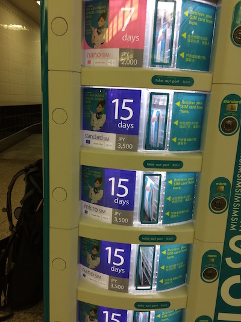

Tokio ist jung, modern, verrückt, lecker, freundlich und chaotisch zugleich aber eins ist Tokyo nicht ... teuer.
Natürlich kann man in Tokyo vergleichsweise viel Geld ausgeben jedoch sollte man das nur beim Essen.

### HOW TO GET IN AND around?

Ich bin mir nicht sicher was sich die Japaner bei ihrem Metrosystem gedacht haben. Das Netz besteht aus 13 verschiedenen Linien und ist für Touristen sehr schwer zu verstehen.
Vom Narita Airport aus gibt es einige Möglichkeiten nach Tokio zu kommen.

<b>Fastest:</b> 
Skyliner, ca. 36 Minuten, ¥2.400

<b>Cheapest:</b> 
Keisei Limited Express zu den Stationen Nippori oder Ueno, 60-80 Minuten, ¥1,000-1,200

Es ist von Vorteil die günstigere Variante zu nehmen und sich direkt eine sogenannte IC-Card am Flughafen zu kaufen.
Mit dieser Guthabenkarte kann man die Metro in Tokio sowie auch Kyoto oder Osaka nutzen.
Empfehlen kann ich die SUICA-Karte, diese erhält man am Narita Express (N'EX) Schalter.

 

###### Tipp:

Mit der SUICA-Karte könnt ihr nur Limited Express oder Local Züge fahren. Für alle anderen muss man extra Fahrkarten kaufen. <a href="http://www.jreast.co.jp/e/pass/suica.html">Mehr Infos dazu hier.</a>

### HOW TO CONNECT?

Am Narita Flughafen stehen mehrere Automaten, an denen man Simkarten kaufen kann. Diese sind mit einem Datenvolumen oder Tagesvolumen ausgestattet.

<a href="http://prepaid-data-sim-card.wikia.com/wiki/Japan">Mehr Informationen findet man hier.</a>

 

### WHERE TO STAY?

Die Stadtteile von Tokio unterscheiden sich extrem. Ähnlich wie in Berlin gibt es hier junge und dynamische oder spießig und langweilige Viertel.  

###### Shibuya

Shibuya zählt ehr zu der ersten Kategorie und ist modern, jung und modebewusst.
Ruhe darf man hier nicht erwarten. Dieser Teil der Stadt scheint immer wach und nie müde.
Dabei kann es auf der bekannten Kreuzung schon mal eng werden und zum Gedränge kommen.

 

Definitiv ein Besuch wert ist das 6 stöckige <a href="www.loft.co.jp">LoFt</a> in Shibuya.

###### Shimokitazawa

Nur vier Stationen von Shibuya entfernt befindet sich der Stadtteil Shimokitazawa.
Hier entsteht die neue Künstlerszene Tokios abseits von den Massen Shibuyas.

###### Ebisu

Der ehr klassische und gehobenere Teil der Stadt.
Hier findet man hochwertige Boutiquen und Cafés.

###### Tipp:

Hotels liegen in Tokio in der höheren Preisklasse. Es lohnt sich also bei Airbnb vorbei zu schauen.
<a href="www.airbnb.de/c/tonim159">Melde dich jetzt an und erhalte kostenlos 20 € Reiseguthaben für deine erste Reise.</a>

### Where to work from?

###### Freeman Cafe 

Ein echt nettes Kaffee, das aufs Arbeiten ausgelegt ist. Die Steckdosenanzahl ist enorm das Wifi gut. Ab 19 Uhr gibt es Cocktails und es darf geraucht werden.

### WHAT TO SEE?

* Eine Ausstellung zB. die Issey Miyake im National Art Center
* Yoyogi-Park (<a href="https://tokyocheapo.com/lifestyle/free-bike-ride-imperial-palace/">Sonntag kann man sich hier Fahrräder kostenlos ausleihen</a>)
* Mori Tower mit Aussichtsplattform

### WHAT TO EAT?

Die japanische Küche ist unglaublich vielseitig. Von Udon (Nudelsuppe) über Sashimi bis hin zu japanischem Curry. Aber vor allem für Seafood Liebhaber ist Tokio ein Paradies.

###### UOBEI in Shibuya 

Shusi Restaurants findet man an jeder Ecke. Dabei gibt es enorme Unterschiede zwischen Qualität und Preis.
Das UOBEI in Shibuya ist eines der günstigsten Sushi Restaurants.
Man sollte etwas Wartezeit einplanen, wenn man zu den Stoßzeiten kommt.
Bestellt wird über ein Tablet am Platz. Das Essen kommt auf einer Schiene gefahren.
Für ca. 100 Yen pro Teller kann man sich den Magen vollschlagen.

###### Tipp
Als Drink Grapefruit oder Lemon Sour mit Shochu.

 

###### Japanisches Curry  

Ein sehr einfaches aber leckeres Gericht mit viel Reis, gemischtem Essiggemüse und wahlweise Shrimps, Rind, Schwein oder Geflügel.  

###### Kaikaya 

Eines der besten Seafood Restaurants in den ich je gewesen bin!
Pflicht ist Sake und die BBQ Tuna Bones sowie die Sashimiplatte.

 

###### marugo deli ebisu 

Sollte man mal genug von Reis haben, kann man hier einen grünen Smoothie trinken oder ein geröstetes Müsli mit Zimt essen.

### WHERE TO GO OUT?

Auch nachts bietet Tokio unglaublich aufregende Spots.
Ob nun im Club oder gediegen in einer Bar, das Nachtleben ist vielseitig.
Jedes Wochenende sind hier einige der besten Djs & Künstler.

Bei <a href="https://www.residentadvisor.net/events.aspx?ai=27">Residentadvisor</a> findet man aktuelle Events & Clubs.

### Good to know?

Bekommt man eine Notification wie unten zu sehen auf sein Iphone sollte man achtsam sein.
Diese Nachricht bedeutet, dass es in Kürze (meist innerhalb von Sekunden) ein Erdbeben geben wird.

 
